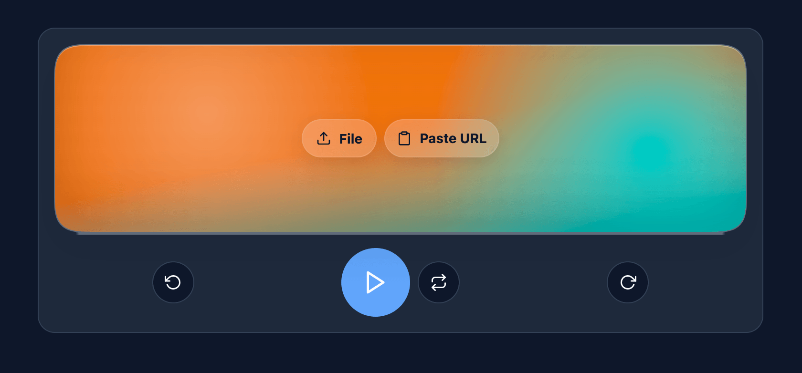

# Ona



Ona is a small, mobile-first audio player built with Svelte focusing on a compact, at-a-glance UI and smooth touch interactions.

[_Ona_](https://ca.wikipedia.org/wiki/Ona) comes from the Catalan word for “wave”, a nod to both sound waves and the fluid, responsive experience the player aims to provide.

### Highlights


- **Mobile-first scrubbing:** pointer-based drag support on the progress seek control for precise touch scrubbing.
- **Animated visuals:** a blurred, animated blob gradient on the seek bar for a modern look (CSS-only).
- **Looping & precise navigation:** set loop start/end (A/B) and drag handles to refine loop points; jump back/forward with buttons or keyboard for precise time adjustments.


### Usage

- **Load audio**: Use the File picker to open a local audio file, or click the "Paste URL" button and paste an HTTP(S) audio URL. The player validates the URL by loading metadata before playing.
- **Shareable URL (optional)**: You can also provide an audio URL via the `a` query parameter (for example, `?a=https://example.com/file.mp3`). If present the app will attempt to load it on startup. When you paste a valid URL the app updates the `a` parameter so the current URL can be shared or revisited.
- **Notes**: Only `http:` and `https:` URLs are supported in the query parameter. Local files selected via the file picker are not persisted to the URL.

### Developer quick-start

1. Install deps and start dev server:

   ```bash
   bun i
   bun dev
   ```

2. Open localhost in your device/emulator.

#### Key files

- `src/lib/Player.svelte` — core player UI and logic, including scrubbing and loop controls.
- `src/app.css` — styling, animated seek gradient, and global interaction rules (scroll/selection).
- `src/main.ts` — app bootstrap and small global handlers (scroll blocking, double-tap prevention scoped fallback).
